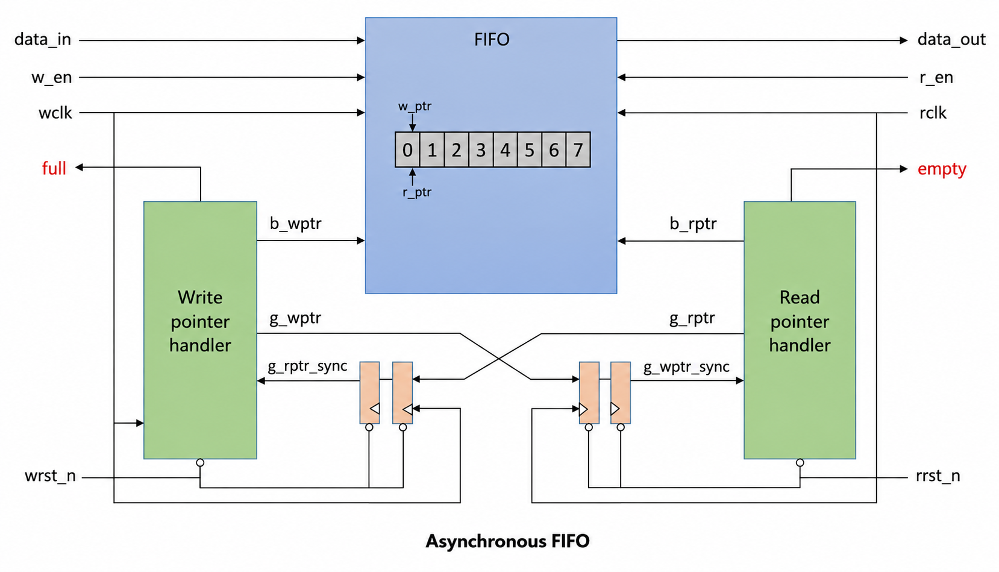

# Asynchronous FIFO

## Architecture

## Features

- Independent read and write clocks
- Gray-coded read/write pointers
- 2-flop clock-domain synchronizers
- Full and empty flag generation
- Dual-port memory
- Parameterized FIFO depth
